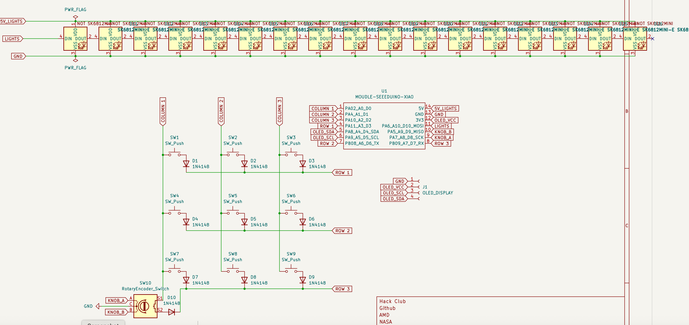
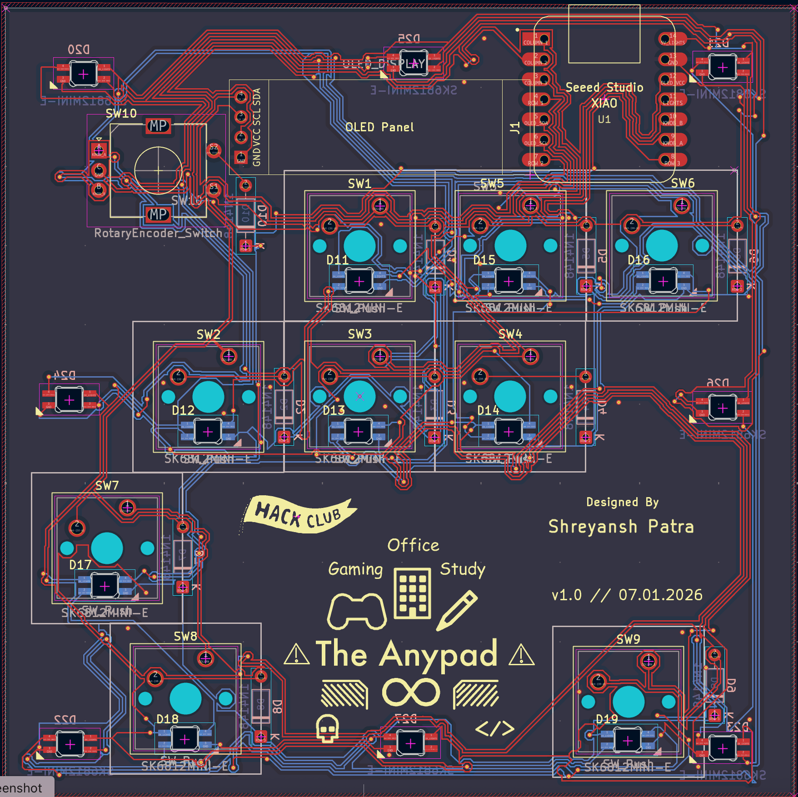
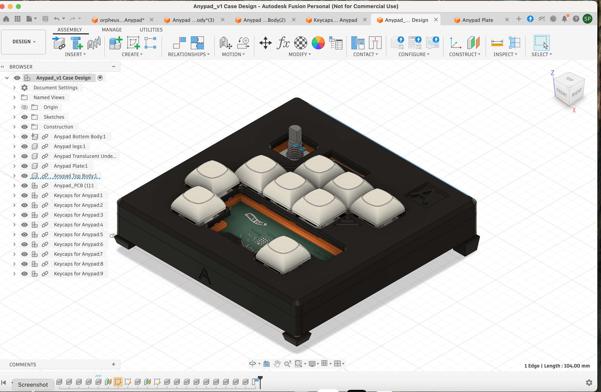

# The Anypad ♾️

A custom left-hand gaming macropad that *actually* respects your muscle memory. Built for the Hack Club Hackpad program.

Most macropads use a rigid ortholinear grid, which is terrible for gaming. If you try to play Minecraft, Valorant, or Roblox on a square grid, your fingers get confused because normal keyboards have a staggered layout. 

**The Anypad** fixes this. It features a true QWERTY-accurate 0.25U stagger for the WASD movement cluster, a dedicated thumb spacebar, and stacked pinky keys for Shift/Ctrl. Add an OLED screen, a rotary encoder, and an aggressive amount of RGB, and you have the ultimate mini-pad designed to seamlessly swap between gaming, office, and study modes.

## 📸 The Screenshots

These are some screenshots of the PCB, Schematic, Case, And complete build.

### Overall Hackpad

*(Note: Coming soon! After Build)*

### Schematic

### PCB Layout

*(Check out the custom silkscreen art on the right!)*

### CAD in Fusion360

---

## ✨ Features
* **Muscle-Memory Layout:** 9 mechanical switches arranged with realistic desktop stagger so you don't miss inputs mid-game.
* **The Brain:** Powered by the Seeed Studio XIAO RP2040.
* **The Knob:** An EC11 Rotary Encoder for scrolling inventory hotbars in games, or adjusting system volume in study mode.
* **The Screen:** A 0.96" OLED display to give visual feedback on your current active profile (Gaming 🎮 / Office 🏢 / Study ✏️).
* **RGB Everything:** 17 total SK6812 MINI-E addressable LEDs (9 per-key backlights + 8 corner underglows for a seamless desk halo effect).

## 🧰 Bill of Materials (BOM)

| Component | Qty | Description |
| :--- | :---: | :--- |
| EC11 Rotary Encoder | 1 | With push-button functionality |
| Encoder Knob | 1 | Fits over the EC11 shaft |
| 0.96" I2C OLED Display | 1 | Standard 4-pin breakout (GND, VCC, SCL, SDA) |
| SK6812 MINI-E LEDs | 17 | 9 for switches, 8 for bottom underglow |
| 1N4148 Diodes | 9 | For the 3x3 anti-ghosting matrix |
| Custom 3D Printed Case | 1 | Top plate + bottom enclosure |
| Keycaps | 9 | 1U caps (can swap 1.25U for Shift and 2U for Space) |

## 🧠 Behind the Hardware (The Wiring Matrix)

To make everything fit on the XIAO's extremely limited edge pins, the 9 keys are wired into a standard 3x3 diode matrix (using only 6 pins). 

This layout strategy frees up the remaining pins perfectly for the I2C OLED (2 pins), the Rotary Encoder (2 pins), and a single data line chained through all 13 NeoPixels without needing to resort to hidden pads or larger microcontrollers. 

---
*Designed by [shreyanshoffline](https://github.com/shreyanshoffline) for Hack Club.*
